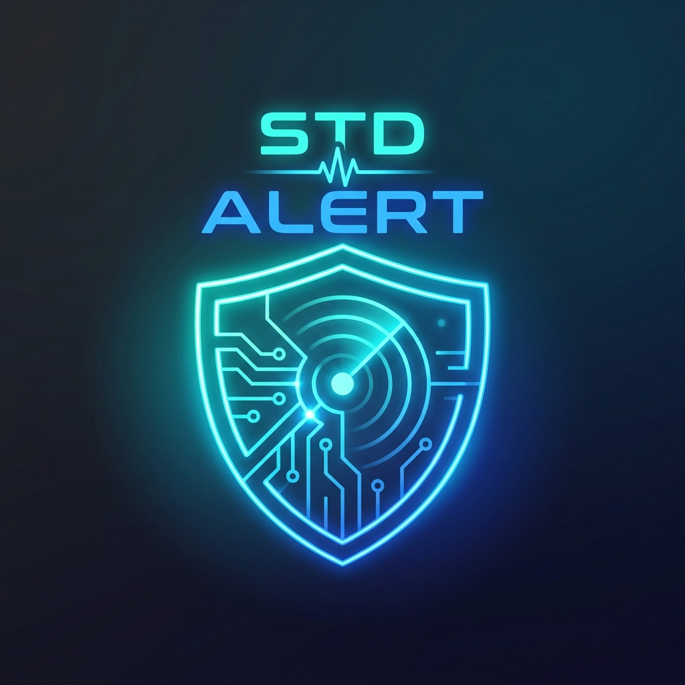

<p align="center">
  
</p>

<h1 align="center">🛡️ STD Alert</h1>

<p align="center">
  <b>The Intelligent Security, Vulnerability & Automated Dependency Bot for GitHub</b><br>
  <i>Auto-updates packages, patches CVEs via OSV.dev, detects leaked secrets, and opens Pull Requests.</i>
</p>

<p align="center">
  <a href="https://github.com/TeamStdNetwork/stdalert/actions"></a>
  <a href="https://github.com/apps/std-alert"></a>
  
  
  
</p>

---

## 📖 What is STD Alert?

**STD Alert** is an advanced dependency maintenance and security bot for your GitHub repositories. Unlike traditional bots that spam you with dozens of unnecessary PRs, **STD Alert** intelligently analyzes your project, prioritizes security patches, groups updates, and detects leaked secrets.

### 🌟 Key Highlights
- 📦 **8 Ecosystems Supported:** Python (pip), Node.js (npm), Docker, Go, Rust (Cargo), Ruby, PHP (Composer), and Java (Maven/Gradle).
- 🔐 **Real-Time CVE Protection:** Integrates directly with Google's **OSV.dev** database to flag and patch vulnerabilities instantly.
- 🕵️ **Leaked Secret Detection:** Scans for accidentally committed AWS keys, GitHub tokens, Google API keys, database URLs, and Stripe keys.
- 📜 **License Compliance:** Alerts you if a dependency's license (e.g. GPL-3.0) conflicts with your repository's license (e.g. MIT/Apache).
- 🔀 **Intelligent Pull Requests:** Raises clean PRs with semver badges (`PATCH`, `MINOR`, `MAJOR`), changelogs, and breaking change warnings.

---

## ⚡ Quick Start: 2 Ways to Use

### Option 1: 1-Minute GitHub Action Setup (Recommended — Zero Install!)

No app installation or admin authorization required! Simply create a workflow file in your repository:

Create `.github/workflows/std-alert.yml`:

```yaml
name: STD Alert

on:
  schedule:
    - cron: '0 0 * * *'  # Runs automatically every midnight UTC
  workflow_dispatch:     # Trigger on-demand anytime with 1 click

permissions:
  contents: write
  pull-requests: write

jobs:
  std-alert:
    runs-on: ubuntu-latest
    steps:
      - uses: actions/checkout@v4
      - uses: TeamStdNetwork/std-alert@main
        with:
          github_token: ${{ secrets.GITHUB_TOKEN }}
```

That's it! GitHub will automatically scan your code and create PRs when updates or security fixes are available.

---

### Option 2: 1-Click GitHub App (No Workflow Files Needed!)

If you prefer zero files in your repository:

1. Visit the official app page: 👉 **[github.com/apps/std-alert](https://github.com/apps/std-alert)**
2. Click **Install**.
3. Select your repositories.
4. Done! Our 24/7 cloud engine will monitor your code remotely.

---

## 📊 Live Web Dashboard

Monitor the security health of your repositories with real-time health grading (A+ to F):
🔗 **[Live Dashboard](https://stdalert-d41fd211559f.herokuapp.com/dashboard/)**

---

## 🤖 Dependabot vs. STD Alert

| Feature | Standard Dependabot | STD Alert 🛡️ |
|---|---|---|
| **Ecosystems** | 4-5 basic | **8 Ecosystems** (Python, Node, Docker, Go, Rust, Ruby, PHP, Java) |
| **Vulnerability Data** | Limited GitHub Advisory | **Global OSV.dev Database** |
| **Secret Scanning** | ❌ None | **✅ Leaked API keys, AWS, DB URLs** |
| **License Compliance** | ❌ None | **✅ Detects GPL vs MIT conflicts** |
| **Code Review Engine** | ❌ None | **✅ Heuristic AST review for SQL injection, bugs** |
| **Unused Dependencies** | ❌ None | **✅ Flags packages that are never imported** |
| **Dual Engine** | App only | **✅ GitHub Action (`uses: ...`) + GitHub App** |
| **PR Clutter** | ❌ High (PR spam) | **✅ Grouped updates with SemVer intelligence** |

---

## 🤝 Community & Support

- 🐛 **Report Issues:** Open an issue in this repository.
- 💬 **Updates & Announcements:** Join our Telegram channel: **[@TeamStdNetwork](https://t.me/TeamStdNetwork)**
- 🏢 **Maintained By:** [Team STD Network](https://github.com/TeamStdNetwork)

---

<p align="center">Made with ❤️ by Team STD Network</p>
